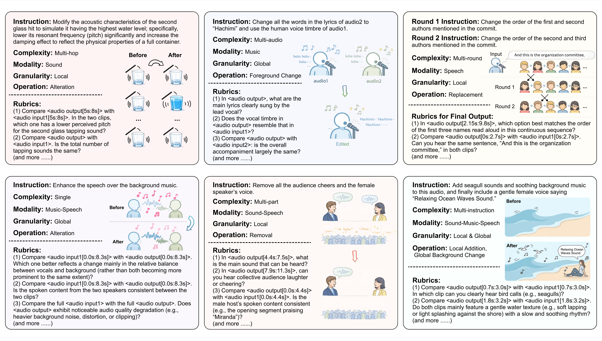

<link href="https://fonts.googleapis.com/css2?family=Inter:wght@400;600;700&display=swap" rel="stylesheet">

<div style="text-align: center; padding: 10px 20px;">
  <div style="margin-bottom: 20px;">
    <!-- Challenge logo will be inserted here after the final asset is provided. -->
  </div>
  <h1 style="font-size: 2em; margin-bottom: 8px; font-weight: 600; font-family: 'Inter', sans-serif; letter-spacing: -0.5px;">Audio Editing Challenge</h1>
  <h2 style="color: #666; font-weight: 400; font-size: 1.5em; margin-bottom: 10px; font-family: 'Inter', sans-serif;">ICASSP 2027 Signal Processing Grand Challenge</h2>
</div>

<!-- News list: keep empty until an announcement and its publication date are confirmed. -->
<div id="news" style="max-width: 980px; margin: 18px auto; padding: 12px 16px; border-radius: 8px; background: #fff; box-shadow: 0 1px 2px rgba(0,0,0,0.03);">
  <style>
    #news .header { font-family: 'Inter', sans-serif; font-weight: 600; font-size: 1.05em; margin-bottom: 8px; }
    #news ul { list-style: none; padding: 0; margin: 0; }
    #news li { display: flex; gap: 12px; align-items: baseline; padding: 8px 0; border-bottom: 1px solid rgba(0,0,0,0.04); }
    #news li:last-child { border-bottom: none; }
    #news .date { color: #999; font-size: 0.9em; width: 86px; flex-shrink: 0; }
    #news .item { font-size: 0.98em; }
    #news .item a { color: #0b66ff; text-decoration: none; }
    #news .item a:hover { text-decoration: underline; }
    @media (max-width: 520px) {
      #news li { flex-direction: column; align-items: flex-start; }
      #news .date { width: auto; margin-bottom: 4px; }
    }
  </style>

  <div class="header">News</div>
  <ul>
    <!-- Confirmed announcements will be added here. -->
  </ul>
</div>

## Introduction

Imagine editing audio as naturally as editing text: remove audience applause while leaving the speaker and room acoustics untouched; replace a song lyric while preserving the singer's voice and accompaniment; or refine a recording through several dependent rounds of instructions. Recent generative audio models are beginning to make such interactions possible, moving audio production from specialized software pipelines toward an intelligent, natural-language interface.

Existing methods span domain-specific speech, music, and sound editing models, general-purpose systems that unify several editing operations and audio modalities, and planner-guided systems that decompose complex instructions into executable steps [1-12].

Current systems can often complete a simple edit in one domain, yet they remain unreliable when an instruction requires precise timing, multiple operations, mixed speech-music-sound content, multi-step reasoning, or multi-round interaction. Even when the requested change is successful, a model may alter speaker identity, musical structure, background ambience, or overall audio quality. On MMAE, existing systems achieve below 5% Exact Match Rate, revealing a wide gap between producing a plausible result and executing an edit completely and faithfully [13].

## Challenge Goals

The **Audio Editing Challenge at ICASSP 2027** studies how to build general-purpose audio editors that can accurately perceive and understand source audio, reason about potentially complex user instructions, and generate the requested modification while preserving everything that should remain unchanged.

The challenge features two complementary tracks:

1. **Single Model Track:** Build one end-to-end model that directly transforms the input audio according to the instruction. This track studies intrinsic, unified audio editing capability without external models or tools.
2. **Agent Track:** Build an autonomous editing system that may plan, invoke multiple locally deployed models or signal-processing tools, inspect intermediate results, and revise its output. This track studies orchestration, tool use, and self-correction.

<div style="text-align: center; margin: 40px 0;">
  
  <p style="margin-top: 12px; color: #666; font-size: 14px; font-style: italic;">Representative examples from the MMAE benchmark, illustrating diverse audio modalities, task complexity, editing granularity and operations, and rubric-based evaluation.</p>
</div>

## Challenge Tracks

### Track 1: Single Model Track

Participants build a **single, end-to-end audio editing model** that consumes one or more input recordings and a natural-language instruction and directly produces the edited audio. All learned components used to understand and execute the edit must belong to one model, without delegating to separately trained perception models, planners, editors, or external services.

[Learn more about Track 1](track1)

### Track 2: Agent Track

Participants build an **autonomous audio editing agent** that may orchestrate multiple open-source models and signal-processing tools, including ASR, captioning, source separation, acoustic analysis, planning, and iterative editing. An agent may maintain structured memory, inspect intermediate audio, and revise its output.

[Learn more about Track 2](track2)

## Benchmark and Evaluation Protocol

### Benchmark

During the development and leaderboard stages, both tracks use the public **MMAE benchmark**, comprising **2,000 examples** and **17,741 atomic rubrics**. The dataset is available on [Hugging Face](https://huggingface.co/datasets/BoJack/MMAE). The final stage introduces **450 previously unreleased examples** constructed through the same MMAE pipeline and manually annotated and verified. Test inputs and editing instructions will be provided for inference, while the rubrics remain private until the official results are finalized. The complete final set and its rubrics will be released after the competition.

### Submission Format

For each test item, participants submit the edited audio file and a JSONL record that maps the sample ID to its relative audio path:

```json
{"id": "<sample_id>", "audio_path": "audio/<sample_id>.wav"}
```

The audio files and JSONL manifest are packaged together and uploaded to the challenge leaderboard. The two tracks are ranked independently.

### Evaluation Metrics

Each rubric is evaluated three times by a frozen Qwen3-Omni model serving as the judge, with shuffled answer choices and majority voting [16]. The leaderboard reports:

1. **Instruction Following Rate (IFR):** the average score over rubrics that verify whether the requested edits were correctly executed.
2. **Consistency Rate (CR):** the average score over rubrics that verify whether unrelated audio content and quality were preserved.
3. **Exact Match Rate (EMR):** the proportion of samples for which all instruction-following and consistency rubrics are satisfied.

Systems are ranked primarily by **Overall EMR**, with ties broken first by Overall IFR and then by Overall CR.

## Registration and Leaderboard

<!-- Registration form and leaderboard URLs will be inserted after they are confirmed. -->

[Learn more about Leaderboard](leaderboard)

## Paper Submission

The top three teams in each track will be invited to submit a two-page ICASSP 2027 paper and present their work in the Grand Challenge session.

[Learn more about Timeline](timeline)

## Contact

<!-- Contact email, community links, and QR codes will be inserted after they are confirmed. -->

## Organizers

<!-- Keep the organizer grid empty until the committee, ordering, affiliations, profile URLs, and portraits are confirmed. -->
<div id="organizers" style="max-width: 980px; margin: 24px auto 60px; padding: 0 16px;">
  <style>
    #organizers .grid {
      display: grid;
      grid-template-columns: 1fr;
      gap: 18px;
    }
    @media (min-width: 720px) {
      #organizers .grid {
        grid-template-columns: 1fr 1fr;
      }
    }
    #organizers .organizer {
      display: flex;
      align-items: center;
      gap: 14px;
      background: #fff;
      padding: 12px;
      border-radius: 8px;
      box-shadow: 0 1px 2px rgba(0,0,0,0.04);
    }
    #organizers .organizer img {
      width: 88px;
      height: 88px;
      object-fit: cover;
      border-radius: 8px;
      flex-shrink: 0;
      background: #f2f2f2;
    }
    #organizers .organizer .meta {
      text-align: left;
    }
    #organizers .organizer .name {
      font-family: 'Inter', sans-serif;
      font-weight: 600;
      font-size: 1.2em;
      margin-bottom: 4px;
    }
    #organizers .organizer .affil {
      color: #666;
      font-size: 0.8em;
      line-height: 1.2;
    }
  </style>

  <div class="grid">
    <!-- Confirmed organizer cards will be added here. -->
  </div>
</div>

<div id="references" style="max-width: 980px; margin: 12px auto 40px; padding: 16px; border-radius: 8px; background:#fff; box-shadow: 0 1px 2px rgba(0,0,0,0.03);">
  <style>
    #references h2 { font-family: 'Inter', sans-serif; font-size: 1.1em; margin: 0 0 10px; }
    #references ol { margin: 0; padding-left: 20px; color: #333; }
    #references li { margin: 8px 0; font-size: 0.95em; line-height: 1.4; }
    #references a { color: #0b66ff; text-decoration: none; }
    #references a:hover { text-decoration: underline; }
  </style>

  <h2>References</h2>
  <ol>
    <li>Peng, Puyuan, et al. "VoiceCraft: Zero-Shot Speech Editing and Text-to-Speech in the Wild." Proc. ACL (2024).</li>
    <li>Zhang, Yixiao, et al. "MusicMagus: Zero-Shot Text-to-Music Editing via Diffusion Models." arXiv:2402.06178 (2024).</li>
    <li>Wang, Yuancheng, et al. "AUDIT: Audio Editing by Following Instructions with Latent Diffusion Models." Proc. NeurIPS (2023).</li>
    <li>Tao, Ye, et al. "MMEdit: A Unified Framework for Multi-Type Audio Editing via Audio Language Model." arXiv:2512.20339 (2025).</li>
    <li>Tian, Zeyue, et al. "Audio-Omni: Extending Multi-modal Understanding to Versatile Audio Generation and Editing." Proc. SIGGRAPH (2026).</li>
    <li>Lan, Zitong, et al. "Guiding Audio Editing with Audio Language Model." Proc. NeurIPS (2025).</li>
    <li>Qiang, Chunyu, et al. "UniSonate: A Unified Model for Speech, Music, and Sound Effect Generation with Text Instructions." Proc. ACL (2026).</li>
    <li>Gong, Junmin, et al. "ACE-Step 1.5: Pushing the Boundaries of Open-Source Music Generation." arXiv:2602.00744 (2026).</li>
    <li>Li, Zhaoqing, et al. "UNISON: A Unified Sound Generation and Editing Framework via Deep LLM Fusion." arXiv:2605.31530 (2026).</li>
    <li>Chen, Junyang, et al. "CosyEdit: Unlocking End-to-End Speech Editing Capability from Zero-Shot Text-to-Speech Models." arXiv:2601.05329 (2026).</li>
    <li>Zhang, Dong, et al. "MiMo-Audio: Audio Language Models are Few-Shot Learners." arXiv:2512.23808 (2025).</li>
    <li>Chen, William, et al. "AudioChat: Unified Audio Storytelling, Editing, and Understanding with Transfusion Forcing." arXiv:2602.17097 (2026).</li>
    <li>Ma, Ziyang, et al. "<a href="https://arxiv.org/abs/2606.07229" target="_blank">MMAE: A Massive Multitask Audio Editing Benchmark</a>." arXiv:2606.07229 (2026).</li>
    <li>Yan, Chao, et al. "Step-Audio-EditX Technical Report." arXiv:2511.03601 (2025).</li>
    <li>Yan, Canxiang, et al. "Ming-UniAudio: Speech LLM for Joint Understanding, Generation and Editing with Unified Representation." arXiv:2511.05516 (2025).</li>
    <li>Xu, Jin, et al. "Qwen3-Omni Technical Report." arXiv:2509.17765 (2025).</li>
  </ol>
</div>

---

<div style="text-align: center; margin-top: 60px; color: #888;">
  <!-- Final GitHub organization or repository link will be inserted here. -->
</div>
